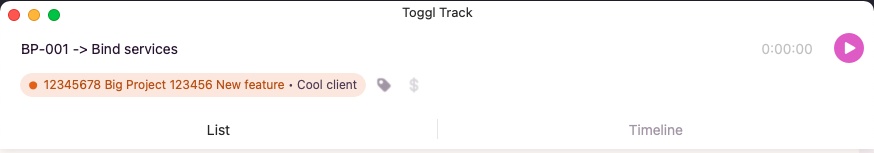
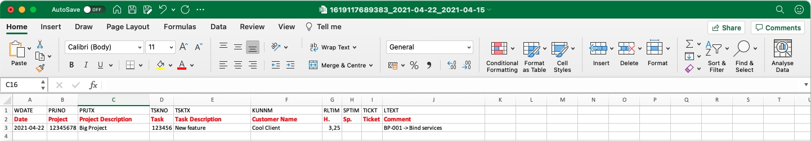

# Ktoggl CLI

Ktoggl CLI vous permet d'utiliser l'API Toggl via un CLI entièrement écrit en Kotlin.

La première feature disponible est la génération d'un *Excel* de timesheets utilisable dans **SAP CATS** via vos enregistrement sur l'application **Toggl**.


## Fonctionnalités

### Export pointages **SAP CATS**

⚠️ La seule contrainte de cette feature est que les informations des projets pointés doivent se trouver dans le titre du projet. En effet, avec la version gratuite de Toggl, vous ne pouvez pas avoir accès aux **Tasks**. Prenez cela comme un workaround 🤓

**SAP CATS** fonctionne sous cette forme : id_projet description_projet id_tâche description_tâche

Si un nom de client est disponible, il faut le rajouter aussi. Attention à la casse !



C'est la seule manipulation nécessaire en amont pour que la génération du fichier *Excel* fonctionne.

Exemple de commande pour générer ce fichier :

```shell
ktoggl sap --api-key votre_clef_api_toggl --workspace le_workspace_id_voulu --since 2021-04-15
```

`--api-key` : Votre clef API se trouve dans vos paramètres de compte Toggl <br />
`--workspace` : L'id du workspace visé (se trouve facilement dans l'url)<br />
`--since` : Date de début pour la récupération des données<br />
`--until` : Date de fin pour la récupération des données (si vide, le jour actuel est pris en compte)<br />

A la fin du processus, des logs permettent d'avoir un apperçu de ce qui a été généré, avec les différences de temps en plus, ou en moins.

Exemple de résultat (⚠️ ceci risque de changer dans le temps) :

```bash
-> (2021-04-05 to 2021-04-22) Excel generation done with 100 entries

-> Summary
14 days exported
Total: 129.96 hours
Total expected: 112 hours

-> Differences based on 8 hours shift / day:
- 2021-04-22: - 1.0
- 2021-04-21: - 1.5
- 2021-04-20: + 0.25
- 2021-04-19: - 0.25
- 2021-04-16: + 0.25
- 2021-04-15: + 0.5
- 2021-04-14: 0.0
- 2021-04-13: 0.0
- 2021-04-12: + 0.5
- 2021-04-09: - 0.25
- 2021-04-08: - 0.25
- 2021-04-07: 0.0
- 2021-04-06: + 2.5
- 2021-04-05: - 7.25
```

Le fichier Excel généré est directement importable dans **SAP CATS**. Vous pouvez ainsi ajuster vos pointages avec le compte rendu.



Vous remarquerez que les heures ont été arrondies au quart supérieur, ou inférieur, pour respecter le standard de pointage de **SAP CATS**.
